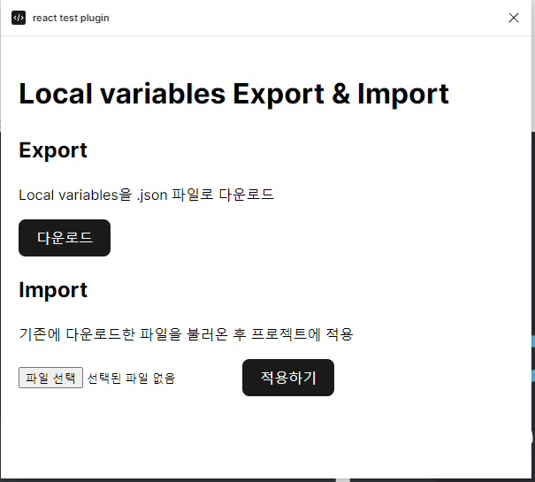
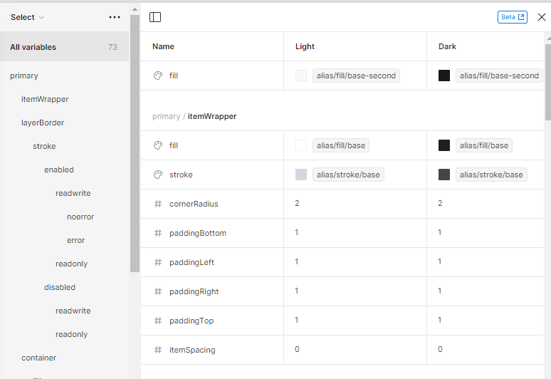

# Figma Plugin Local variables Export + Import

## 시작하기

1. `yarn` install

2. `yarn build:ui --watch`, `yarn build:main --watch` 두개의 watch 실행

3. Plugins > Development > Import plugin from manifest... 선택 후 해당 프로젝트 `manifest.json`선택 (개발과정 참고)

## 플러그인 작업 이유

현재 작업 중인 or 새로 작업할 프로젝트에서 이전에 작업했던 Local variables을 가져오는 기능이 필요함.

직접 수작업으로 가져오던가 다른 플러그인을 사용하면 링크가 깨져서 사용하기 힘들다는 디자이너의 피드백.

## 플러그인 기능 설명

간단하게 다운로드 + 적용

### Export

가져올 프로젝트에서 다운로드를 클릭해서 .json 파일 다운로드

### Import

추가하고 싶은 프로젝트에서 다운받은 파일을 첨부해서 적용하기 버튼 클릭

### 결과

복사된 Local variables 확인해 보니 alias 연결까지 잘 된 것으로 확인.

## 개발과정

[개발과정.md](./docs/개발과정.md)

## 기타

- 실제 사내 프로젝트에서는 collections를 선택해서 원하는 collection만 복사할 수 있도록 개발을 진행했다.
- resize 기능이 필요해서, [create-figma-plugin에서 use-window-resize을 커스텀해서 사용](https://github.com/yuanqing/create-figma-plugin/blob/main/packages/ui/src/hooks/use-window-resize.ts)
